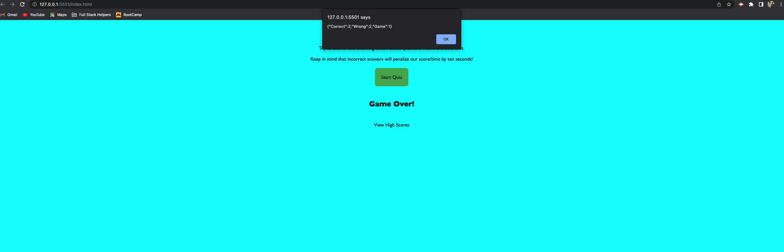

# Technical Quiz

This repo hosts quiz app which is based on JavaScript. In order to run the applicaiton. Clone the repo to your local machine and open `index.html` in your browser.

## How to play Quiz and its rules.

- Click on the `Start Quiz ` Button.
- Timer starts for 60 seconds. Try to finish the quiz within given timeframe.
- Select the Radio button for the one user feels its correct.
- Once selected, click on `Next Question` Button for next question and `result` of current question.
- For every incorrect answer, 10 seconds will be deducted from the timer. 
- Once timer is over, Game is over and user can check the stats from `View HighScore` 

## Screenshots of application.

- Start the Quiz

- Correct Answer View

- Wrong Answer View with time deduction.

- Game over.

- Highscore/Stats.

